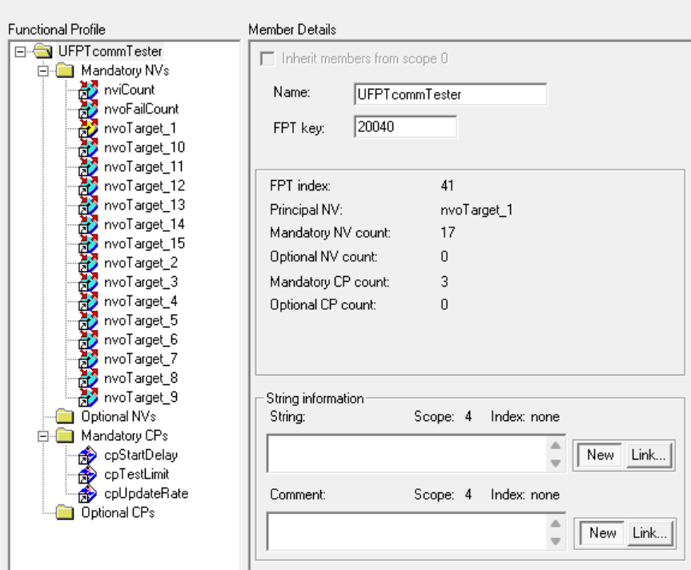
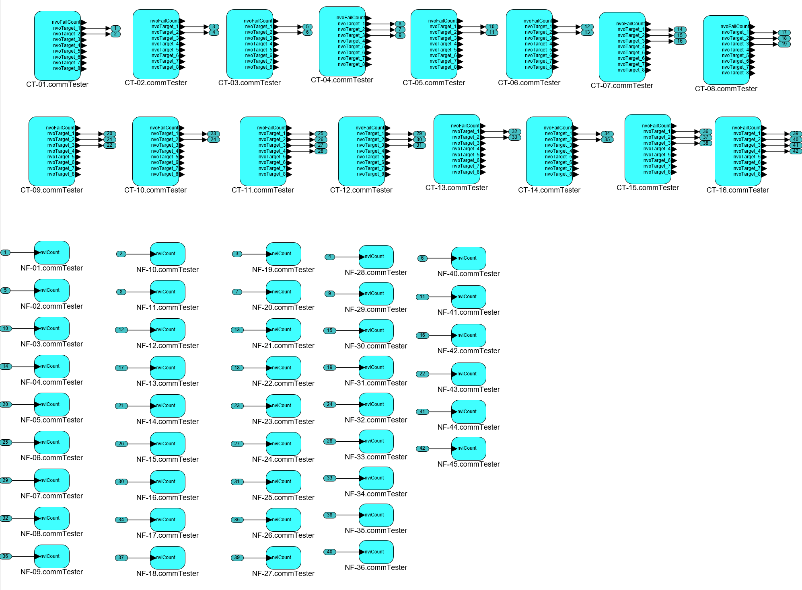

# ft-compliance-test

This project provides a reference implementation of scripts and an application supporting the test requirements described in the LonMark ISO/IEC 14908-2 Compliance Test document, dated 6-May-2026.  Echelon NodeBuilder project files are included.  The NodeBuilder project name is CommTest2.

## Purpose

Verify LON FT transceiver communication compliance with the ISO/IEC 14908-2 standard and compatibility with existing LonMark TP/FT-10 devices and networks.

## Methodology

Provide a test framework for the tests described in the following list.  These tests compare the communications performance of LON devices implemented with Renesas FT transceivers to Device Under Test (DUT) LON devices implemented with the FT transceiver to be qualified:

- **Baseline Quiet-Line Test**. Verify that a single sender and a single receiver using Renesas FT transceivers can complete 100,000 transactions with zero errors on a maximum-length FT channel with no other traffic.
- **Baseline Peer-to-Peer Performance Test**.  Verify that multiple senders and multiple receivers using Renesas FT transceivers can simultaneously complete 100,000 transactions per sender with less than a 0.01% transaction failure rate on a maximum-length FT channel with 64 FT devices when using three retries per transaction.
- **DUT Quiet-Line Test**.  Verify that a single sender and a single receiver using DUT transceivers can complete 100,000 transactions with zero errors on a maximum-length FT channel with no other traffic.
- **DUT Peer-to-Peer Performance Test**.  Verify that multiple senders and multiple receivers using a mix of Renesas FT transceivers and DUT transceivers can simultaneously complete 100,000 transactions per sender with less than a 0.01% transaction failure rate on a maximum-length FT channel with 64 FT devices when using three retries per transaction.
- **DUT Long-Term Peer-to-Peer Performance Test**.  Verify that there is no communications reliability degradation for the DUT devices during 14 days of continuous operation.

The quiet-line tests are implemented using NodeUtil.  The peer-to-peer performance tests are implemented with an application implementing a single functional block based on the following profile.

## Key Features

Following are the key features of the `UFPTcommTester` profile:

- Support long running test cases in excess of 100,000 transactions
- Maintain transmit and receive counters with 32-bit counters
- Track transmit failures and verify correct receive sequencing
- Broadcast Clear Status messages before starting test messaging
- Periodic pacing using application timers
- Failure tracking for NV update failures
- Receiver-side detection of out-of-sequence count values
- Sending devices verify the completion of an update before generating another update

## Profile

The `UFPTcommTester` profile has the following members:

- `SNVT_count_32 nviCount`.  An input used by a receiver to receive network variable updates from a sender and to detect skipped sequence number updates.  This input is not used on a sender.
- `SNVT_count_32 nvoFailCount`.  An output used to report the number of test failures for the device.  For a sender this is the number of failed update transactions for a test.  For a receiver this is the number of skipped or out-of-sequence sequence numbers for a test.
- `SNVT_count_32 nvoTarget_1` to `nvoTarget_15`.  Fifteen outputs used by a sender to send network variable updates to up to fifteen connections.  These outputs are not used on a receiver.
- `SCPTdelayTime cpStartDelay`.  Test startup offset in tenths of a second for a sender.  A sender waits for 10 seconds plus the configured startup offset before sending the first update for a test.  The default startup offset is zero, providing a 10 second startup delay by default.  This value is not used on a receiver.
- `SCPTmaxRnge cpTestLimit`.  The number of successful transactions for a sender to conclude a test.  Set to 100,000 by default.  This value is not used on a receiver.
- `SCPTupdateRate cpUpdateRate`.  If non-zero, configures the device as a sender and the value specifies a delay update in tenths of a second; a value of zero configures the device as a receiver.  The delay update value specifies the delay from transaction completion of an update to sending the next update.  Set to zero for a receiver and set to a default value of 0.2 seconds (raw value of 2) for a sender.  The maximum delay is 5 seconds.

## Behavior

- At startup:
  1. If `cpUpdateRate` is non-zero, configure the device as a sender.
  2. Delay for 10 seconds plus the configured start delay.
  3. Send a domain broadcast with a repeat count of 8 and a Clear Status (0x53) message code.
  4. Find the number of bound outputs.
  5. Set the active NV to the first NV output.
  6. Set `testCount` to 0.
  7. Set the test update interval to max(`cpUpdateRate`, 5 seconds).
  8. Set the output update timer to one second.
- For a sender, when the output update timer expires:
  1. Stop the test if the test count reaches `cpTestLimit` (100,000 default).
  2. Send `testCount` to the active NV.
  3. Increment the active NV (one of `nvoTarget_1`..`nvoTarget_15`) to the next output, wrapping to zero and incrementing `testCount` after all bound targets have been updated.
- For a sender, when an NV update succeds, set the output timer to the test update interval.
- For a sender, when an NV update fails, increment `nvoFailCount` and set the output timer to the test update interval.
- For a receiver, when an incoming `nviCount` value is received:
  1. If the received value does not equal `testCount`, increment `nvoFailCount`.
  2. Increment `testCount`.

## Key Files

- `CommTest2/commTester.nc` - main application logic for commTester functionality
- `CommTest2/commTester.h` - component declarations and interface definitions
- `CommTest2/common.h` - shared project definitions

## Notes

- Senders are are devices that have bound connections to one or more nvoTarget_[n] outputs connected to a like devices nviCount input.  And the cpUpdateRate that is note zero.  2 should be considered the minimum (.2s)
- Receivers consider a missing or skipped count as a test failure and increment `failTotal`.
- The LonMark resource file set: apollo_dev.zip should be added to the test PC's types catalog if you are using IzoT Net Server.
- The IzoT CT Backup `ComplianceTest.zip` is the 61 device network including (16) FT-6050 Evb and (45) FT 3150 based devices used for baseline testing.  The connections use Ack'd service with 3 retries and default IzoT CT channel timing parameter.  Be sure to setup the Apollo_dev.typ file set before restoring the database.

## Baseline Testing

The system for the baseline test was configured using IzoT CT.  The operation of the test is done using nodeutil and the scripts found in the directory <b>Scripts</b> With the <b>Scripts</b> as the current working directory run.  The .snu scripts must be modified to match the test network NIDs.  Devices.txt is prepared to name the devices as defined in the CT project.  The CLI application StatusParser.exe converts the raw nodeutil output of the various snu scripts to a CSV file for presentation:

## Quiet Wire Test

This test verifies the physical layer performance.  In this test, noteutil uses the performance test command with 0 retries to send an application message using code: 0x01.  The receiving node response message code 0x02 and the exact data that was received.

1. `nodeutil -b -h -dx.default.rni -iquietline.snu`
2. `quietline.snu` will generate 1640 messages to each of the 61 devices.  This will take about 2.5 hours to execute.
3. When the traffic stops, Type: `nodeutil -b -h dx.default.o-218 -ireport.snu -orawQuiet.txt` 
4.  Type: `statusparser rawQuiet.txt devices.txt Quiet_ddmmyyyy.csv`

## Peer-to-Peer Performance

In this test there are (16) sending devices that use acknowledged service with (3) retries to update each bound nvoTarget_[n] in a round robin fashion. Updates are offered only every 0.2 seconds by each of the senders.  At the start of the test the senders are reset, and there will be a random start where each sender boardcasts the clear status network diagnostic command to all devices on the channel. After each a total of `cpTestLimit` nv updatas are sent, the sender stops generating traffic.  With all senders configured with the same `cpUpdateRate` (0.2s) and same `cpTestLimit` (100,000) the network traffic will drop from 70% BW utilization to 0.  It is assumed that the original setup has initialized all the senders with `cpStartDelay` and `cpTestLimit`.  The script peertest.snu will handle setting the cpUpdateRate for the 16 sender devices.   

1. `nodeuitl -b -h -dx.default.rni -ipeertest.snu`
2. Allow 6 hours for the test to complete.  BW utilization will be close to 70% and in aggregate, 1.6 million acknowleged updates will occur.
3. Type: `nodeutil -b -h -dx.default.rni -ireport.snu -orawPeertest.txt`   
4. Type: `statusparser rawPeerTest.txt devices.txt Peer_ddmmyyyy.csv`.
